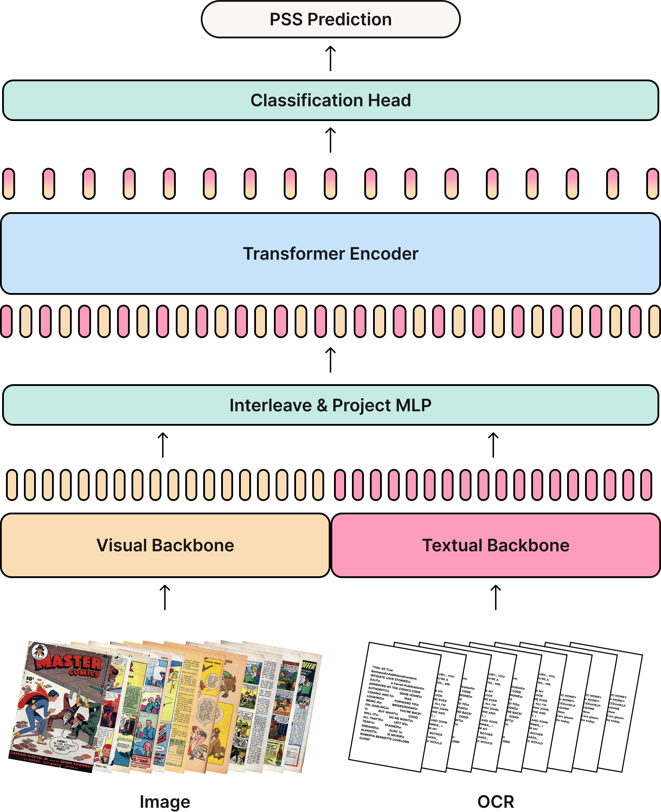

# CoSMo: A Multimodal Transformer for Page Stream Segmentation in Comic Books


A novel multimodal Transformer for robust Page Stream Segmentation (PSS) in comic books, enabling scalable content analysis and metadata enrichment.

## About The Project

This project introduces **CoSMo**, a groundbreaking multimodal Transformer designed for **Page Stream Segmentation (PSS)** in comic books. PSS is a critical initial step for automated content understanding, paving the way for downstream tasks like character analysis, story indexing, and metadata enrichment. Comic books present unique computational challenges due to their richly illustrated content, stylized typography, and non-linear panel layouts, making traditional document parsing pipelines insufficient.

CoSMo formalizes the PSS task for this unique medium and leverages a new, meticulously annotated dataset of 20,800 comic pages. It consistently outperforms traditional baselines and even significantly larger general-purpose vision-language models across key metrics such as F1-Macro, Panoptic Quality, and stream-level metrics. Our research highlights the dominance of visual features for comic PSS macro-structure while demonstrating the crucial benefits of multimodal integration in resolving complex ambiguities, setting a new state-of-the-art for scalable comic book analysis.

<div align="center">
    
</div>

*Figure 1:Automated Page Stream Segmentation in Comics. Our model accurately identifies semantic page types in comic book streams for robust content analysis.*

## Key Features

*   **State-of-the-Art PSS:** Achieves superior performance in Page Stream Segmentation for comic books.
*   **Multimodal & Vision-Only Variants:** Offers a robust multimodal model integrating visual and textual features, as well as a computationally efficient vision-only alternative.
*   **Transformer-Based Architecture:** Leverages an end-to-end Transformer encoder to capture long-range narrative dependencies within comic book streams.
*   **High-Quality Dataset:** Developed and evaluated on a new, meticulously annotated 20,800-page dataset for comic book PSS.
*   **Scalable Comic Analysis:** Establishes a foundation for automated, scalable analysis of large comic book corpora.

## Getting Started

To get a local copy up and running, follow these simple steps.

### Prerequisites

Make sure you have [Anaconda](https://www.anaconda.com/download) or [Miniconda](https://www.anaconda.com/docs/getting-started/miniconda/install#quickstart-install-instructions) installed on your system. This project is built with Python 3.9 and requires several packages that can be installed via pip.

### Installation

1.  Create and activate a Conda environment (recommended: Python 3.9):
    ```bash
    conda create --name cosmo python=3.9
    conda activate cosmo
    ```
2.  Clone the repository:
    ```bash
    git clone https://github.com/mserra0/CoSMo-ComicsPSS.git
    cd CoSMo-ComicsPSS
    ```
3.  Install the necessary dependencies:
    ```bash
    pip install -r requirements.txt
    ```

### Usage

CoSMo is designed to process sequential streams of comic book pages for semantic segmentation. While specific scripts are not detailed here, a typical workflow would involve:

1.  **Data Preparation:** Ensure your scanned or digitized comic book pages are organized for processing (e.g., as image files with corresponding OCR outputs if using the multimodal variant).
2.  **Running CoSMo:** The model can be used for training or inference by running cosmo.py with the appropriate flags. Configuration YAML files for training examples can be found in the CoSMo/configs folder:
    ```bash
    python cosmo.py \
        --config configs/multimodal_cosmo.yaml \
        --train \
        --precompute \
        --gpu_id 0
    ```
   * --config: Specifies the path to the configuration YAML file.

   * --train: Set this flag to train the model. Omit it for inference.

   * --precompute: Enables offline precomputation of features, which can speed up training.

   * --gpu_id: Specifies the GPU ID to use if available (e.g., 0, 1, etc.).

## Methodology

CoSMo (Comic Stream Modeling) is a novel Transformer-encoder model specifically designed for robust Page Stream Segmentation in comic books. Its architecture integrates both visual and textual information within a sequential context to tackle the unique multimodal challenges of the medium.

<div align="center">
    
</div>
*Figure 3: Multimodal CoSMo model architecture. For a detailed view, refer to the paper.*

CoSMo operates in two primary variants:
*   **Multimodal Model:** Leverages visual features (obtained from a frozen SigLIP backbone) and contextualized textual embeddings (extracted from Qwen2.5-VL-32B OCR output). These features are projected to a shared dimensionality, interleaved to form a dual-token representation per page (one for visual, one for textual), and then processed by a Transformer encoder.
*   **Vision-Only Model:** A computationally efficient alternative that relies exclusively on visual information, omitting OCR extraction and textual embedding components.

Both variants utilize a Transformer encoder to model contextual dependencies across the entire comic book sequence, followed by a classification head for semantic page type prediction.

For a detailed explanation of our methodology, please refer to the paper: [CoSMo: A Multimodal Transformer for Page Stream Segmentation in Comic Books](CoSMo__A_Multimodal_Transformer_for_Page_Stream_Segmentation_in_Comic_Books.pdf).

## Contributing

Contributions are what make the open-source community such an amazing place to learn, inspire, and create. Any contributions you make are **greatly appreciated**.

If you have a suggestion that would make this better, please fork the repo and create a pull request. You can also open an issue with the tag "enhancement".

1.  Fork the Project
2.  Create your Feature Branch (`git checkout -b feature/AmazingFeature`)
3.  Commit your Changes (`git commit -m 'Add some AmazingFeature'`)
4.  Push to the Branch (`git push origin feature/AmazingFeature`)
5.  Open a Pull Request

## License

Distributed under the MIT License. See `LICENSE.txt` for more information.

## Acknowledgments

I extend my sincere gratitude to **Dr. Dimosthenis Karatzas** and **Emanuele Vivoli** for their invaluable mentorship and guidance throughout this research. I also acknowledge the public domain archives, particularly the **Digital Comics Museum** and **Comic Book Plus**, which were instrumental in curating the dataset for this project.
